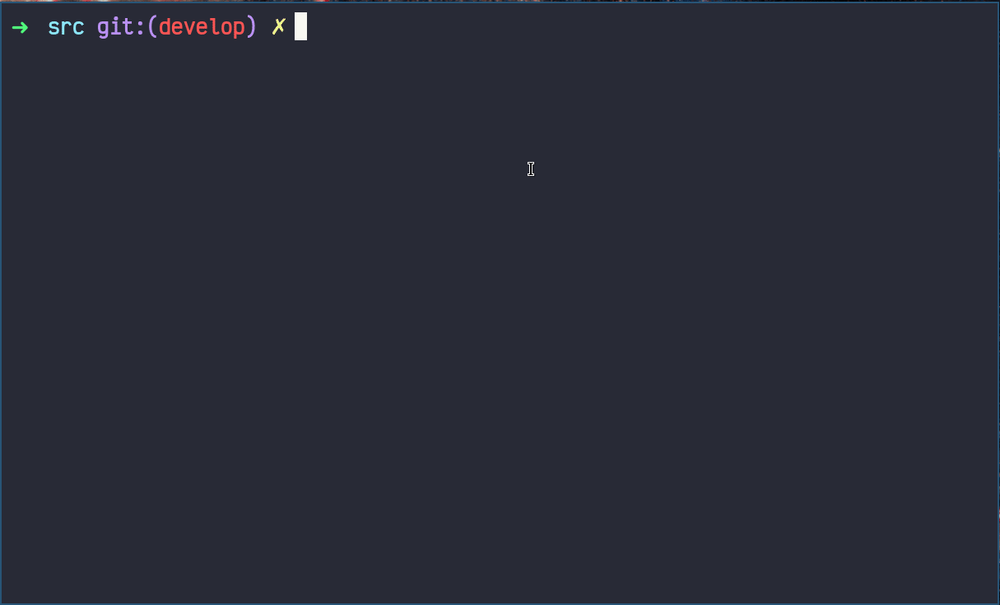

# Bigint Calculator

## Table of contents
* [Introduction](#introduction)
* [Goals](#goals)
* [Task](#task)
* [Build](#build)
* [Tests](#tests)
* [Credits](#credits)

## Introduction

Implementation of `decimal` value type in C language. This type represents 96-bit signed real number featuring opratinons without floating point imprecision. The library also provides an API for working with this type.

## Goals 

- Understand low level binary operations  
- Implement a binary api for BigInt math 
- Fully covered with tests using [Check](https://libcheck.github.io/check/)

## Task
### Intro

The Decimal value type represents decimal numbers ranging from positive 79,228,162,514,264,337,593,543,950,335 to negative 79,228,162,514,264,337,593,543,950,335. The default value of a Decimal is 0. The Decimal value type is appropriate for financial calculations that require large numbers of significant integral and fractional digits and no round-off errors. The Decimal type does not eliminate the need for rounding. Rather, it minimizes errors due to rounding.

When the result of the division and multiplication is passed to the Round method, the result suffers no loss of precision.

A decimal number is a floating-point value that consists of a sign, a numeric value where each digit in the value ranges from 0 to 9, and a scaling factor that indicates the position of a floating decimal point that separates the integral and fractional parts of the numeric value.

The binary representation of a Decimal value consists of a 1-bit sign, a 96-bit integer number, and a scaling factor used to divide the 96-bit integer and specify what portion of it is a decimal fraction. The scaling factor is implicitly the number 10, raised to an exponent ranging from 0 to 28. Therefore, the binary representation of a Decimal value the form, ((-2^96 to 2^96) / 10^(0 to 28)), where -(2^96-1) is equal to MinValue, and 2^96-1 is equal to MaxValue.

The scaling factor also can preserve any trailing zeros in a Decimal number. Trailing zeros do not affect the value of a Decimal number in arithmetic or comparison operations. 

### Binary representation

The binary representation of a Decimal number consists of a 1-bit sign, a 96-bit integer number, and a scaling factor used to divide the integer number and specify what portion of it is a decimal fraction. The scaling factor is implicitly the number 10, raised to an exponent ranging from 0 to 28.

Decimal number can be implemented as a four-element array of 32-bit signed integers (`int bits[4];`).

`bits[0]`, `bits[1]`, and `bits[2]` contain the low, middle, and high 32 bits of the 96-bit integer number accordingly.

`bits[3]` contains the scale factor and sign, and consists of following parts:
- Bits 0 to 15, the lower word, are unused and must be zero.
- Bits 16 to 23 must contain an exponent between 0 and 28, which indicates the power of 10 to divide the integer number.
- Bits 24 to 30 are unused and must be zero.
- Bit 31 contains the sign; 0 meaning positive, and 1 meaning negative.

Note that the bit representation differentiates between negative and positive zero. These values can be treated as being equal in all operations.

### Example:

```c
typedef struct 
{
    usigned int bits[4];
} s21_decimal;
```

### Arithmetic Operators

| Operator name | Operators  | Function                                                                           | 
| ------ | ------ |------------------------------------------------------------------------------------|
| Addition | + | int s21_add(s21_decimal value_1, s21_decimal value_2, s21_decimal *result)         |
| Subtraction | - | int s21_sub(s21_decimal value_1, s21_decimal value_2, s21_decimal *result) |
| Multiplication | * | int s21_mul(s21_decimal value_1, s21_decimal value_2, s21_decimal *result) | 
| Division | / | int s21_div(s21_decimal value_1, s21_decimal value_2, s21_decimal *result) |
| Modulo | Mod | int s21_mod(s21_decimal value_1, s21_decimal value_2, s21_decimal *result) |

The functions return the error code:
- 0 - OK
- 1 - the number is too large or equal to infinity
- 2 - the number is too small or equal to negative infinity
- 3 - division by 0

*Note on the numbers that do not fit into the mantissa:*
- *When getting numbers that do not fit into the mantissa during arithmetic operations, use bank rounding (for example, 79,228,162,514,264,337,593,543,950,335 - 0.6 = 79,228,162,514,264,337,593,543,950,334)*

*Note on the mod operation:*
- *If an overflow occurred as a result, discard the fractional part (for example, 70,000,000,000,000,000,000,000,000,000 % 0.001 = 0.000)*


### Comparison Operators

| Operator name | Operators  | Function | 
| ------ | ------ | ------ |
| Less than | < | int s21_is_less(s21_decimal, s21_decimal) |
| Less than or equal to | <= | int s21_is_less_or_equal(s21_decimal, s21_decimal) | 
| Greater than | > |  int s21_is_greater(s21_decimal, s21_decimal) |
| Greater than or equal to | >= | int s21_is_greater_or_equal(s21_decimal, s21_decimal) | 
| Equal to | == |  int s21_is_equal(s21_decimal, s21_decimal) |
| Not equal to | != |  int s21_is_not_equal(s21_decimal, s21_decimal) |

Return value:
- 0 - FALSE
- 1 - TRUE

### Convertors and parsers

| Convertor/parser | Function | 
| ------ | ------ |
| From int  | int s21_from_int_to_decimal(int src, s21_decimal *dst) |
| From float  | int s21_from_float_to_decimal(float src, s21_decimal *dst) |
| To int  | int s21_from_decimal_to_int(s21_decimal src, int *dst) |
| To float  | int s21_from_decimal_to_float(s21_decimal src, float *dst) |

Return value - code error:
- 0 - OK
- 1 - Convertation error

*Note on the conversion of a float type number:*
- *If the numbers are too small (0 < |x| < 1e-28), return an error and value equal to 0*
- *If the numbers are too large (|x| > 79,228,162,514,264,337,593,543,950,335) or are equal to infinity, return an error*
- *When processing a number with the float type, convert all the digits contained in it*

*Note on the conversion from decimal type to int:*
- *If there is a fractional part in a decimal number, it should be discarded (for example, 0.9 is converted to 0)*


### Another functions

| Description | Function                                                         | 
| ------ |------------------------------------------------------------------|
| Rounds a specified Decimal number to the closest integer toward negative infinity. | int s21_floor(s21_decimal value, s21_decimal *result)            |	
| Rounds a decimal value to the nearest integer. | int s21_round(s21_decimal value, s21_decimal *result)    |
| Returns the integral digits of the specified Decimal; any fractional digits are discarded, including trailing zeroes. | int s21_truncate(s21_decimal value, s21_decimal *result) |
| Returns the result of multiplying the specified Decimal value by negative one. | int s21_negate(s21_decimal value, s21_decimal *result)   |

## Build

```
$ git clone https://github.com/bezlant/s21_bigint
$ cd s21_bigint/src/
$ make
```

### Tests
* Unit tests are implemented using [Check](https://libcheck.github.io/check/) & coverage report with [LCOV](https://github.com/linux-test-project/lcov)


## Credits
- Developers: [Mikhail Kuznetsov (@posidoni)](https://github.com/AndreyZhelannikov), [Andrey Jhelannikov(@capricey)](https://github.com/AndreyZhelannikov), [Anton Bezludniy(@tarticar)](https://github.com/bezlant).
- Thanks to [Stepan Fedorov(@nanadaug)](https://github.com/co-cy) for providing a Python testing framework.
